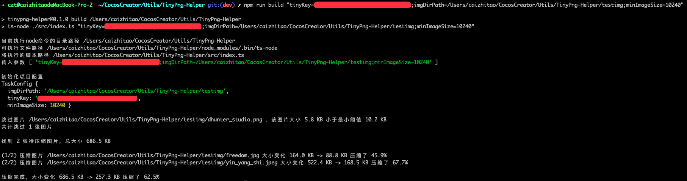

# TinyPng Helper

[](CHANGELOG.md)

一个压缩指定文件夹的所有图片的工具。

## 一、下载并初始化项目

首次使用需要先安装环境:

```
git clone git@github.com:zhitaocai/TinyPng-Helper.git
cd TinyPng-Helper
npm i 
```

## 二、使用方法

```
npm run build "imgDirPath=this_project_abs_path/testimg;tinyKey=xxx"
```

参数格式:

* ``"param1=value1;param2=value2;..."``

参数说明：

* ``imgDirPath``: 图片所在文件夹的绝对路径
* ``tinyKey``: Tiny 的 API Key，在 [Ting 官网申请](https://tinypng.com/) 即可（很简单，填邮箱即可注册获取到 API Key）

运行示例： 



## 三、注意事项

* 由于内部压缩采用的是 [TinyPng 的 API](https://tinypng.com/developers/reference/nodejs) 去实现，**申请回来的 Tiny Png API Key 每个月只能免费压缩 500个 图片**，如果该月已经超过这个压缩数量，将不能压缩图片。解决这个问题的一些参考方法：
  * 花钱提升每个月的图片压缩数量
  * 等下个月，又可以重新获取 500 个额度
  * 多用几个邮箱注册多几个TnyPng账号以获取多个 API Key
* 压缩实际原理是上传本地文件到 TinyPng 后端服务，然后 TinyPng 后端服务压缩完毕后，脚本再下载压缩后的图片到本地，因此**请保持网络通畅**，否则可能压缩失败
* 目前仅支持以下类型图片的压缩
  * png
  * jpg
  * jpeg
* 脚本采用的文件头部魔数进行图片类型识别，因此只要是脚本支持的图片类型的图片，哪怕该图片文件的后缀名不是期望的后缀（如：一张 png 图片，但是后缀不是 `.png`），脚本也会识别为目标图片，也会将这些非期望后缀的图片进行压缩


## 四、支持一下作者吧

如果此项目对你有帮助，不妨支持一下我吧~


## LICENSE

    MIT License

    Copyright (c) 2021 Zhitao Cai

    Permission is hereby granted, free of charge, to any person obtaining a copy
    of this software and associated documentation files (the "Software"), to deal
    in the Software without restriction, including without limitation the rights
    to use, copy, modify, merge, publish, distribute, sublicense, and/or sell
    copies of the Software, and to permit persons to whom the Software is
    furnished to do so, subject to the following conditions:

    The above copyright notice and this permission notice shall be included in all
    copies or substantial portions of the Software.

    THE SOFTWARE IS PROVIDED "AS IS", WITHOUT WARRANTY OF ANY KIND, EXPRESS OR
    IMPLIED, INCLUDING BUT NOT LIMITED TO THE WARRANTIES OF MERCHANTABILITY,
    FITNESS FOR A PARTICULAR PURPOSE AND NONINFRINGEMENT. IN NO EVENT SHALL THE
    AUTHORS OR COPYRIGHT HOLDERS BE LIABLE FOR ANY CLAIM, DAMAGES OR OTHER
    LIABILITY, WHETHER IN AN ACTION OF CONTRACT, TORT OR OTHERWISE, ARISING FROM,
    OUT OF OR IN CONNECTION WITH THE SOFTWARE OR THE USE OR OTHER DEALINGS IN THE
    SOFTWARE.
